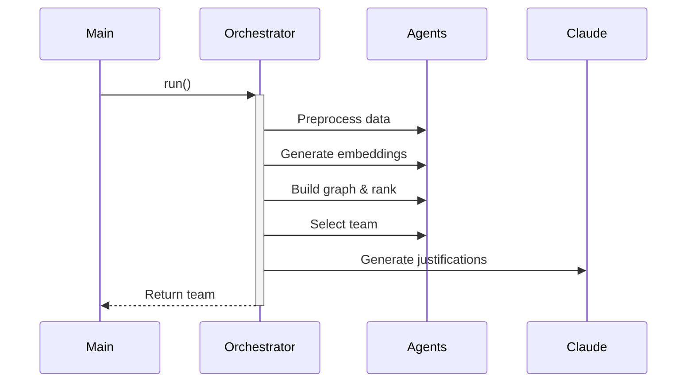

# AI-Powered Hiring System

A sophisticated hiring system that uses AI, graph algorithms, and LLMs to select optimal teams based on candidates' skills, diversity, and role-specific requirements.

## Overview

The AI-Powered Hiring System processes candidate data through a pipeline of specialized agents to select the best possible team for a startup. It combines natural language processing, graph algorithms, and large language models to evaluate candidates holistically and build well-rounded teams.

## Features

- **Data Processing**: Extract and structure candidate data from JSON/CSV files
- **Semantic Matching**: Generate embeddings for candidates to find semantic similarities
- **Graph-Based Ranking**: Build heterogeneous skill-candidate-role graphs and use PageRank for scoring
- **Diversity Optimization**: Select teams with complementary skills and diverse backgrounds
- **LLM-Powered Justifications**: Generate natural language justifications for selections using Claude
- **RESTful API**: Access all functionality through a FastAPI interface

## Architecture

### Core Components

The system is built around a modular, agent-based architecture:

1. **Orchestration Layer**:
   - `HiringOrchestrator`: Standard sequential pipeline
   - `HiringCrewOrchestrator`: Alternative using CrewAI for autonomous agents

2. **Agent System**:
   - `PreprocessingAgent`: Extract and structure candidate data
   - `EmbeddingAgent`: Generate vector embeddings for semantic matching
   - `GraphRerankerAgent`: Create heterogeneous graphs and rank using PageRank
   - `DiversityAgent`: Optimize team composition for diversity metrics
   - `JustifierAgent`: Generate natural language justifications using Claude

3. **Data Models**:
   - `Candidate`: Core candidate data structure
   - `Team`/`TeamMember`: Selected team representations
   - Various supporting models for education, experience, etc.

4. **API Layer**:
   - FastAPI application exposing core functionality

### Sequence Flow



## Installation

1. Clone this repository
```bash
git clone https://github.com/your-username/ai-hiring-system.git
cd ai-hiring-system
```

2. Create and activate a virtual environment
```bash
python -m venv hiring_venv
source hiring_venv/bin/activate  # On Windows: hiring_venv\Scripts\activate
```

3. Install dependencies
```bash
pip install -e .
```

4. Configure AWS credentials (for Claude access)
```bash
aws configure
```

## Usage

### Command Line Interface

Run the standard hiring pipeline:

```bash
python -m hiring_system.main --data path/to/candidates.json --team-size 5
```

Get top candidates for each role:

```bash
python -m hiring_system.main --data path/to/candidates.json --top-candidates --top-n 3
```

Use Claude's tool use for final selection:

```bash
python -m hiring_system.main --data path/to/candidates.json --use-tool-use
```

### API

Start the API server:

```bash
python run_api.py
```

Example API requests:

```bash
# Get top candidates for each role
curl -X POST "http://localhost:8000/top-candidates" \
  -H "Content-Type: application/json" \
  -d '{"data_path": "path/to/candidates.json", "candidates_per_role": 3}'

# Run the full hiring pipeline
curl -X POST "http://localhost:8000/run-hiring-pipeline" \
  -H "Content-Type: application/json" \
  -d '{"data_path": "path/to/candidates.json", "team_size": 5}'
```

## Directory Structure

```
hiring_system/
├── __init__.py
├── api.py          # FastAPI application
├── main.py         # Command-line interface
├── requirements.txt
├── agents/         # Specialized agents
│   ├── __init__.py
│   ├── preprocessing_agent.py
│   ├── embedding_agent.py
│   ├── graph_reranker_agent.py
│   ├── diversity_agent.py
│   └── justifier_agent.py
├── config/         # Configuration
│   ├── __init__.py
│   └── settings.py
├── pipeline/       # Orchestration
│   ├── __init__.py
│   └── orchestrator.py
└── utils/          # Utilities
    ├── __init__.py
    ├── bedrock_client.py
    ├── models.py
    ├── tool_handlers.py
    └── tool_specs.py
```

## Technologies Used

- **NLP**: SentenceTransformer for embedding generation
- **Graph Algorithms**: NetworkX for graph construction and PageRank scoring
- **Vector Search**: FAISS for similarity searches
- **LLM Integration**: AWS Bedrock (Claude) for justification generation
- **API Framework**: FastAPI for exposing functionality
- **Agent Frameworks**: Optional CrewAI integration

## License

MIT

## Contributors

- Your Name
